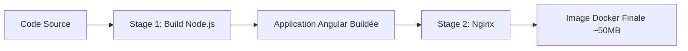

# 🚀 Guide de Déploiement - SmartLogi Frontend

Ce guide explique comment déployer l'application Angular SmartLogi en utilisant Docker et Nginx.

## 📋 Table des matières

- [Prérequis](#prérequis)
- [Architecture](#architecture)
- [Déploiement Local](#déploiement-local)
- [Configuration](#configuration)
- [Déploiement en Production](#déploiement-en-production)
- [CI/CD](#cicd)
- [Troubleshooting](#troubleshooting)

## 🔧 Prérequis

Avant de commencer, assurez-vous d'avoir installé :

- **Docker** (version 20.10 ou supérieure)
  ```bash
  docker --version
  ```

- **Docker Compose** (version 2.0 ou supérieure)
  ```bash
  docker-compose --version
  ```

- **Git** (pour cloner le repository)
  ```bash
  git --version
  ```

## 🏗️ Architecture

L'application utilise une architecture multi-stage Docker :



### Composants

1. **Stage Build** : Utilise Node.js 20 Alpine pour compiler l'application Angular
2. **Stage Production** : Utilise Nginx Alpine pour servir les fichiers statiques
3. **Configuration Nginx** : Optimisée pour le routing Angular et les performances

## 🐳 Déploiement Local

### Méthode 1 : Docker Compose (Recommandé)

La méthode la plus simple pour tester localement :

```bash
# Cloner le repository
git clone <votre-repo-url>
cd sdmsAngular

# Lancer l'application
docker-compose up -d

# Vérifier les logs
docker-compose logs -f

# Accéder à l'application
# http://localhost:8080
```

Pour arrêter l'application :

```bash
docker-compose down
```

### Méthode 2 : Docker Build Manuel

Pour plus de contrôle sur le processus de build :

#### Sur Linux/Mac :

```bash
# Rendre le script exécutable
chmod +x scripts/build.sh

# Build de l'image
./scripts/build.sh

# Lancer le container
docker run -d -p 8080:80 --name smartlogi-frontend smartlogi-frontend:latest
```

#### Sur Windows (PowerShell) :

```powershell
# Build de l'image
.\scripts\build.ps1

# Lancer le container
docker run -d -p 8080:80 --name smartlogi-frontend smartlogi-frontend:latest
```

### Méthode 3 : Commandes Docker Directes

```bash
# Build de l'image
docker build -t smartlogi-frontend:latest .

# Lancer le container
docker run -d \
  -p 8080:80 \
  --name smartlogi-frontend \
  smartlogi-frontend:latest

# Vérifier que le container fonctionne
docker ps

# Voir les logs
docker logs -f smartlogi-frontend

# Arrêter le container
docker stop smartlogi-frontend

# Supprimer le container
docker rm smartlogi-frontend
```

## ⚙️ Configuration

### Variables d'Environnement

Créez un fichier `.env` à partir du template :

```bash
cp .env.example .env
```

Modifiez les valeurs selon votre environnement :

```env
# URL de l'API Backend
API_URL=http://localhost:8080/api

# Port d'exposition du frontend
FRONTEND_PORT=8080

# Environnement
NODE_ENV=production
```

### Configuration Nginx

Le fichier `nginx.conf` contient la configuration du serveur web. Principales fonctionnalités :

- **Routing Angular** : Redirection de toutes les routes vers `index.html`
- **Compression Gzip** : Réduction de la taille des fichiers transférés
- **Cache des Assets** : Cache d'1 an pour les fichiers statiques
- **Headers de Sécurité** : Protection contre XSS, clickjacking, etc.

Pour modifier la configuration :

1. Éditez `nginx.conf`
2. Rebuild l'image Docker
3. Redémarrez le container

### Proxy API (Optionnel)

Si vous souhaitez proxifier les appels API à travers Nginx, décommentez cette section dans `nginx.conf` :

```nginx
location /api {
    proxy_pass http://backend:8080;
    proxy_http_version 1.1;
    proxy_set_header Upgrade $http_upgrade;
    proxy_set_header Connection 'upgrade';
    proxy_set_header Host $host;
    proxy_set_header X-Real-IP $remote_addr;
    proxy_set_header X-Forwarded-For $proxy_add_x_forwarded_for;
    proxy_set_header X-Forwarded-Proto $scheme;
    proxy_cache_bypass $http_upgrade;
}
```

## 🌐 Déploiement en Production

### Prérequis Production

- Serveur Linux (Ubuntu 20.04+ recommandé)
- Docker et Docker Compose installés
- Nom de domaine configuré
- Certificat SSL (Let's Encrypt recommandé)

### Étapes de Déploiement

#### 1. Préparation du Serveur

```bash
# Connexion SSH au serveur
ssh user@votre-serveur.com

# Installation de Docker
curl -fsSL https://get.docker.com -o get-docker.sh
sudo sh get-docker.sh

# Installation de Docker Compose
sudo curl -L "https://github.com/docker/compose/releases/latest/download/docker-compose-$(uname -s)-$(uname -m)" -o /usr/local/bin/docker-compose
sudo chmod +x /usr/local/bin/docker-compose

# Vérification
docker --version
docker-compose --version
```

#### 2. Déploiement de l'Application

```bash
# Créer le répertoire de l'application
sudo mkdir -p /opt/smartlogi-frontend
cd /opt/smartlogi-frontend

# Cloner le repository
git clone <votre-repo-url> .

# Configurer les variables d'environnement
cp .env.example .env
nano .env  # Modifier selon votre configuration

# Lancer l'application
docker-compose up -d

# Vérifier le statut
docker-compose ps
docker-compose logs -f
```

#### 3. Configuration HTTPS avec Reverse Proxy

Pour la production, il est recommandé d'utiliser un reverse proxy (Traefik, Caddy, ou Nginx) devant votre application.

**Exemple avec Traefik :**

Créez un fichier `docker-compose.prod.yml` :

```yaml
version: '3.8'

services:
  frontend:
    build:
      context: .
      dockerfile: Dockerfile
    container_name: smartlogi-frontend
    restart: unless-stopped
    networks:
      - web
    labels:
      - "traefik.enable=true"
      - "traefik.http.routers.smartlogi.rule=Host(`smartlogi.example.com`)"
      - "traefik.http.routers.smartlogi.entrypoints=websecure"
      - "traefik.http.routers.smartlogi.tls.certresolver=letsencrypt"

networks:
  web:
    external: true
```

Lancez avec :

```bash
docker-compose -f docker-compose.prod.yml up -d
```

### Mise à Jour de l'Application

```bash
# Se connecter au serveur
ssh user@votre-serveur.com
cd /opt/smartlogi-frontend

# Récupérer les dernières modifications
git pull

# Rebuild et redémarrer
docker-compose down
docker-compose up -d --build

# Nettoyer les anciennes images
docker system prune -f
```

## 🔄 CI/CD

### GitHub Actions

Le workflow GitHub Actions (`.github/workflows/docker-build.yml`) automatise :

1. **Tests** : Exécution des tests unitaires et E2E
2. **Build** : Construction de l'image Docker
3. **Push** : Publication vers GitHub Container Registry
4. **Deploy** : Déploiement automatique vers staging/production

**Configuration requise :**

Dans les Settings de votre repository GitHub :
- Aucun secret supplémentaire nécessaire (utilise `GITHUB_TOKEN` automatiquement)
- Configurer les environnements `staging` et `production` si nécessaire

### GitLab CI/CD

Le pipeline GitLab (`.gitlab-ci.yml`) comprend 3 stages :

1. **test** : Tests unitaires et E2E
2. **build** : Build et push de l'image Docker
3. **deploy** : Déploiement SSH vers les serveurs

**Variables à configurer dans GitLab :**

| Variable | Description |
|----------|-------------|
| `CI_REGISTRY` | URL du registry Docker |
| `CI_REGISTRY_USER` | Utilisateur du registry |
| `CI_REGISTRY_PASSWORD` | Mot de passe du registry |
| `SSH_PRIVATE_KEY` | Clé SSH pour le déploiement |
| `STAGING_SERVER` | Adresse du serveur staging |
| `STAGING_USER` | Utilisateur SSH staging |
| `PRODUCTION_SERVER` | Adresse du serveur production |
| `PRODUCTION_USER` | Utilisateur SSH production |

## 🔍 Troubleshooting

### Le container ne démarre pas

```bash
# Vérifier les logs
docker-compose logs frontend

# Vérifier l'état du container
docker ps -a

# Redémarrer le container
docker-compose restart
```

### Erreur 404 sur les routes Angular

Vérifiez que la configuration Nginx contient :

```nginx
location / {
    try_files $uri $uri/ /index.html;
}
```

### L'application ne se connecte pas à l'API

1. Vérifiez l'URL de l'API dans votre configuration Angular
2. Si vous utilisez le proxy Nginx, vérifiez la configuration
3. Assurez-vous que le backend est accessible depuis le container

```bash
# Tester depuis le container
docker exec -it smartlogi-frontend sh
wget -O- http://votre-backend:8080/api/health
```

### Problèmes de permissions

```bash
# Donner les permissions au script de build
chmod +x scripts/build.sh

# Problèmes avec Docker
sudo usermod -aG docker $USER
# Puis se déconnecter et reconnecter
```

### L'image Docker est trop volumineuse

L'image devrait faire environ 50MB. Si elle est plus grande :

1. Vérifiez que `.dockerignore` exclut bien `node_modules/`
2. Assurez-vous d'utiliser les images Alpine
3. Vérifiez qu'il n'y a pas de fichiers inutiles copiés

```bash
# Analyser la taille de l'image
docker images smartlogi-frontend:latest

# Voir les layers de l'image
docker history smartlogi-frontend:latest
```

### Problèmes de cache

```bash
# Build sans cache
docker-compose build --no-cache

# Nettoyer le cache Docker
docker system prune -a
```

## 📊 Monitoring et Logs

### Voir les logs en temps réel

```bash
# Avec Docker Compose
docker-compose logs -f

# Avec Docker
docker logs -f smartlogi-frontend
```

### Vérifier l'utilisation des ressources

```bash
# Stats du container
docker stats smartlogi-frontend

# Espace disque utilisé
docker system df
```

## 🔐 Sécurité

### Bonnes Pratiques

1. **Ne jamais commiter** les fichiers `.env` avec des secrets
2. **Utiliser HTTPS** en production
3. **Mettre à jour régulièrement** les images Docker
4. **Limiter les ressources** du container si nécessaire :

```yaml
services:
  frontend:
    # ...
    deploy:
      resources:
        limits:
          cpus: '0.5'
          memory: 512M
```

5. **Scanner les vulnérabilités** :

```bash
# Avec Docker Scout
docker scout cves smartlogi-frontend:latest

# Avec Trivy
trivy image smartlogi-frontend:latest
```

## 📚 Ressources Supplémentaires

- [Documentation Docker](https://docs.docker.com/)
- [Documentation Nginx](https://nginx.org/en/docs/)
- [Angular Deployment Guide](https://angular.io/guide/deployment)
- [Docker Compose Documentation](https://docs.docker.com/compose/)

## 🆘 Support

Pour toute question ou problème :

1. Consultez d'abord ce guide
2. Vérifiez les logs du container
3. Consultez la documentation officielle
4. Ouvrez une issue sur le repository

---

**Dernière mise à jour** : Janvier 2026
